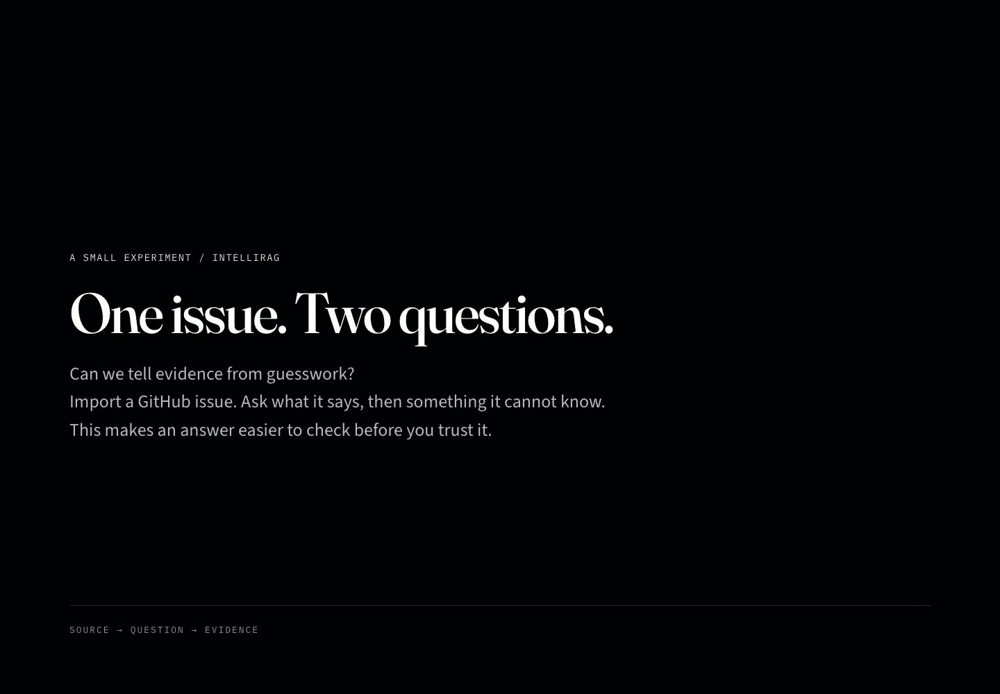
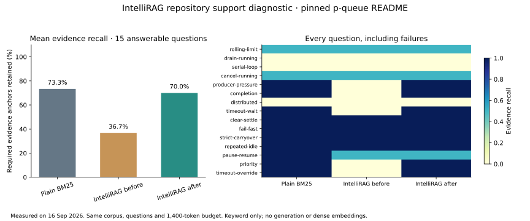
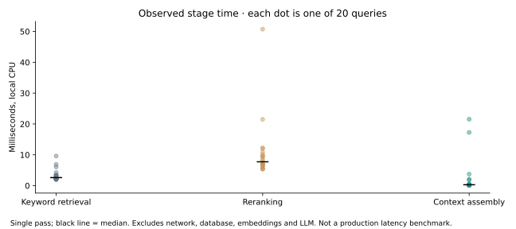

# IntelliRAG

Repository support answers you can trace back to evidence.

**The problem:** your docs explain each API, but a real support question asks how their rules fit together. IntelliRAG retrieves the relevant passages, passes them to a language model when configured, and keeps citations and retrieval decisions visible.

**Try this:** open the preloaded, pinned `sindresorhus/p-queue` README and ask how to change shared configuration while jobs are still queued. The answer must combine pause, running-job completion and queue-idle behavior. The landing page offers this as a one-click question with the source already loaded. Without a model key, it shows cited extracts.

[Why each architecture step exists](docs/architecture/web-rag-decisions.md) · [Evaluation protocol and raw evidence](eval/repo-support/README.md)

**Live web status (September 2026):** [Public Vercel console](https://intellirag-live-own-track.vercel.app/) is running from this canonical repository. It currently supports keyword retrieval, cited extracts, issue ingestion and a lexical graph. Persistent semantic/hybrid production acceptance remains dependent on Postgres and provider configuration. See [the production setup and acceptance runbook](WEB.md) and [the measured audit with open findings](audit/REPORT.md).

[](https://intellirag-live-own-track.vercel.app/walkthrough)

[Watch the real browser experiment](https://intellirag-live-own-track.vercel.app/walkthrough). import an issue, inspect its citations and graph, test a refusal, and reuse a cached answer. Narrated, with a quiet original score and captions in the site’s own typography.

**Pilot proposal:** [10-slide deck and PDF](https://intellirag-live-own-track.vercel.app/pilot/index.html) · [research, evidence and interview guide](docs/sales/research-and-pilot.md). Focus: technical support answers with inspectable evidence; proposed pilot targets are explicitly separate from measured results.

## Measured repository-support diagnostic



On 15 answerable questions from one pinned p-queue README, fixing document-level deduplication raised required-evidence recall from **36.7% to 70.0%**. Plain BM25 scored **73.3%**. This is a narrow improvement over our previous implementation, **not a win over the baseline or a generated-answer accuracy claim**. Five additional probes test unsupported questions. No LLM ran in this retrieval experiment.



[Dataset, before/after runs, uncertainty and limitations](eval/repo-support/README.md). Gemini 3.7 Flash generation and independent answer judging remain pending provider configuration. Local stage timings exclude network, storage and generation.

**Python platform:** [phase history and historical benchmarks](PYTHON-PLATFORM.md) describe `rag-platform/`, a separate implementation. Its deterministic/mock CI results do not measure the public web deployment.

**Repository:** [github.com/charan-rathore/IntelliRAG](https://github.com/charan-rathore/IntelliRAG)

The live dark-theme browser lab is in [`web/`](web/). see [WEB.md](WEB.md). This is the only GitHub repo. The Python platform stays in `rag-platform/`.

## Run the web app

```sh
cd web
npm ci
npm run dev
```

Open `http://localhost:8080`. The pinned p-queue demo and built-in runbooks are available without a key. Add a provider in Settings for generated answers. Browser keys remain request-local; never commit them. For server configuration and durable storage, follow [WEB.md](WEB.md).

## A focused product hypothesis

**Customer:** a developer-tool company whose support engineers repeatedly answer questions across SDK documentation, release notes and repository issues.

**Job:** draft a support decision, with the exact source version and passages a reviewer needs to check it. Start with queue configuration, cancellation and safe shutdown questions. An API lookup is easy; combining several API guarantees without inventing a guarantee is the hard part.

**Business stake:** incorrect advice creates escalations and repeated engineering work. The pilot measures time to an accepted answer, material errors and reviewer effort. We have not measured customer ROI or support deflection yet.

**First pilot:** 30 historical, permissioned support tickets from one product; two reviewers; a frozen repository version; a simple BM25 baseline; identical answer models and context budgets. Ship drafts for human approval. Success requires fewer material errors or faster accepted answers at a declared cost, not merely a nicer demo. See [the pilot brief](docs/sales/repository-support-pilot.md).

## Where to look

| Need | Location |
|---|---|
| Try the product | [Live console](https://intellirag-live-own-track.vercel.app/) |
| Understand the design choices | [Web architecture](docs/architecture/web-rag-decisions.md) |
| Audit measured results | [Evaluation protocol, dataset and raw runs](eval/repo-support/README.md) |
| Deploy and configure | [Web operations guide](WEB.md) |
| Review commercial assumptions | [Research and pilot evidence](docs/sales/research-and-pilot.md) |
| Inspect implementation | [`web/src/lib/rag/`](web/src/lib/rag/) |
| Explore the separate Python implementation | [Python platform reference](PYTHON-PLATFORM.md) |

## Verification and current limits

The production quality workflow builds the app, checks TypeScript, and runs hardening, persistence and RAG regression tests. The current RAG suite covers pipeline stages (chunk → BM25 → retrieve → evidence gate), question prediction, and suggestion persistence. The broader template suite still contains legacy assumptions about missing `.grok` files and old template metadata; it is not all green.

The public demo has no server model key or durable production vector index configured. Its no-key response shows source excerpts, not LLM reasoning. Suggested questions are predicted from each ingested document and ranked with community ask counts; without Postgres those counts are ephemeral across cold starts. Gemini answer quality, independent judge agreement, multi-repository generalization and production latency remain open measurements. The evaluation runner is ready to record those results with an explicit spending cap.
