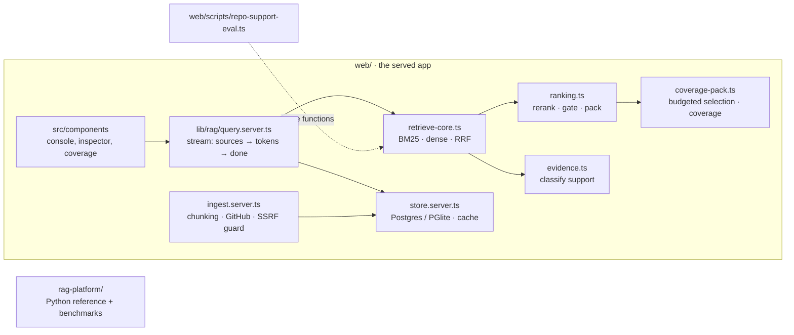

# IntelliRAG

**Retrieval that decides what it can prove before a model speaks.**

Ask a question about a pinned source. IntelliRAG finds the passages, checks whether they actually support an answer, packs them into a fixed token budget, and tells you which parts of your question the context never mentions. If the evidence isn't there, it refuses instead of improvising.

[**Try the live console**](https://intellirag-live-own-track.vercel.app/) · [Interactive architecture](https://intellirag-live-own-track.vercel.app/architecture.html) · [Browser walkthrough](https://intellirag-live-own-track.vercel.app/walkthrough) · [Measured evaluation](eval/repo-support/README.md) · [Code graph](docs/codegraph/README.md)


Follow the numbers. **1–2**: you ask. **3–7**: the evidence is decided *before* any model runs. **8**: you get the answer, its citations, and the question terms nothing in the context covers. **A–C** happen offline: ingest at a pinned commit, an optional model, and a frozen evaluation that calls the same functions the server does.

## The problem

Retrieval-augmented systems rarely fail by answering from nothing. They fail by answering *with* sources attached. In a 2026 penalty-aware audit, 98% and 100% of two commercial RAG products' wrong answers came with cited sources or grounding chunks ([arXiv:2608.26385](https://arxiv.org/abs/2608.26385)). Practitioners describe the same failure: the retriever returns something topically close, and the model fills the gap convincingly.

Most of these errors happen when the retrieved context is *relevant but insufficient* ([Sufficient Context, ICLR 2025](https://arxiv.org/abs/2411.06037)). So IntelliRAG treats "is this enough to answer?" as a first-class, inspectable decision, not something left to the prompt.

## What it does differently

| Stage | Decision | Where |
|---|---|---|
| Retrieve | BM25, plus dense vectors only when compatible stored embeddings exist, fused with RRF | [`retrieve-core.ts`](web/src/lib/rag/retrieve-core.ts) |
| Rerank | A calibrated mix of idf recall, phrase and title overlap. It is not a cross-encoder and not a confidence score. | [`ranking.ts`](web/src/lib/rag/ranking.ts) |
| Gate | A passage needs a support floor and distinctive overlap; a decisive rank-1 margin keeps only that source. If nothing passes, the answer is a refusal with no citations. | [`ranking.ts`](web/src/lib/rag/ranking.ts), [`evidence.ts`](web/src/lib/rag/evidence.ts) |
| Pack | 1,400-token budget. Passages are verbatim slices of the stored chunk, code fences are never split, and a chunk that doesn't fit is trimmed to its most relevant contiguous paragraphs. | [`ranking.ts`](web/src/lib/rag/ranking.ts), [`coverage-pack.ts`](web/src/lib/rag/coverage-pack.ts) |
| Measure | Lists the question terms (function words and quantities removed) that appear in no packed passage, shown under every answer | [`coverage-pack.ts`](web/src/lib/rag/coverage-pack.ts), [`context-coverage.tsx`](web/src/components/rag/context-coverage.tsx) |
| Answer | With a server or visitor key: temperature 0 and a cite-or-refuse prompt. Without one: cited extracts, labelled as extracts. | [`query.server.ts`](web/src/lib/rag/query.server.ts) |
| Cache | Keyed by question, corpus and a policy hash covering retrieval mode, evidence policy, model and graph edits. Corrections invalidate it. | [`graphify/persist.server.ts`](web/src/lib/rag/graphify/persist.server.ts), [`query.server.ts`](web/src/lib/rag/query.server.ts) |

The coverage line reads like this on a question the source can't settle:

> **5/9 question terms in context** · not found: `server` `processes` `durable`

That is the honest summary of "does this README establish a shared, durable rate limit across three servers?": it doesn't.

## Measured, including what lost

One pinned README ([sindresorhus/p-queue](https://github.com/sindresorhus/p-queue) at `180ab9e`), 15 answerable questions with exact evidence anchors, 5 that must be refused, and the same 1,400-token budget for every arm. No model runs in these numbers; they measure whether the required evidence reached the reader.

| Arm | Clean corpus | + distractor documents | Refused 5/5 |
|---|---:|---:|:---:|
| Plain BM25 | 73.3% | 63.3% | — |
| IntelliRAG, rank-order packing (**default**) | 73.3% | **83.3%** | ✓ |
| IntelliRAG, coverage-aware packing (opt-in) | **76.7%** | 73.3% | ✓ |

The default ties BM25 on the clean corpus and beats it by 20 points once noise documents are mixed in. The coverage packer wins one extra question on the clean corpus, but the gain's bootstrap interval is [−10, +20] points, and it loses 10 points under distractors. So it stays opt-in. Every run, including the losing ones, is in [`eval/repo-support/runs/`](eval/repo-support/runs/), and the [evaluation write-up](eval/repo-support/README.md) covers method, history and limits.

## Research behind the design

| Paper | What we took | Status here |
|---|---|---|
| [Sufficient Context](https://arxiv.org/abs/2411.06037) (Joren et al., ICLR 2025) | Errors concentrate where context is relevant but insufficient, so expose sufficiency before trusting fluency | Lexical proxy shipped on every answer; an LLM autorater is not used |
| [AdaGReS](https://arxiv.org/abs/2512.25052) (2025) | Redundancy-penalised greedy selection under a token budget with an adaptive penalty | Implemented in `coverage-pack.ts`; opt-in after measurement |
| [Lin & Bilmes](https://aclanthology.org/P11-1052/) (ACL 2011) | Cost-benefit greedy plus a best-single-unit check for knapsack-constrained submodular selection | Implemented; the guarantee holds only without the redundancy term |
| [Recall Is Not Enough](https://arxiv.org/abs/2607.00725) (2026) | Score what the packed context contains, not the candidate list | The eval scores the text actually packed, after trimming |
| [Lost in the Middle](https://arxiv.org/abs/2307.03172) (TACL 2024) | Position matters; keep the strongest evidence first | The top supported chunk is the whole-chunk anchor |

## Use it from your coding agent

IntelliRAG also runs as an MCP server with no dependencies, so Claude Code, Codex, Hermes or any MCP client can answer from a repository's docs with citations, or refuse:

~~~sh
claude mcp add intellirag -- npx -y github:charan-rathore/IntelliRAG                    # Claude Code
codex mcp add intellirag -- npx -y github:charan-rathore/IntelliRAG                     # Codex
hermes mcp add intellirag --command npx --args -y github:charan-rathore/IntelliRAG     # Hermes Agent
~~~

```
> index_folder                        (the repo you're in, or index_github owner/repo at a pinned commit)
> ask  "How do I cancel a queued task with an AbortSignal?"   session: fix-1234
  3 supported passages from sindresorhus/p-queue@180ab9e …
> ask  "What if it is already running?"                        session: fix-1234
  Reading: Read as a follow-up: searched together with the previous question (about abortsignal, cancel).
  [readme.md#14] readme.md › options › signal
  If the operation is already running, the signal will need to be handled by the operation itself.
> ask  "What production database password does it specify?"   session: fix-1234
  REFUSED. Nothing in this corpus passed the support gate for this question.
```

It exposes seven tools: `index_folder`, `index_github`, `ask`, `search`, `feedback`, `new_topic` and `sources`. They call the same retrieval, support gate, packing and conversation reading as the console (`web/src/lib/rag`), bundled into [`mcp/dist`](mcp/dist/intellirag-mcp.mjs) and checked over stdio in CI. The agent skill is [`skills/intellirag/SKILL.md`](skills/intellirag/SKILL.md), written to Hermes Agent's authoring standard. The Hermes catalog entry is [`integrations/hermes/manifest.yaml`](integrations/hermes/manifest.yaml).

## Run it

~~~sh
git clone https://github.com/charan-rathore/IntelliRAG.git
cd IntelliRAG/web
npm ci
npm run dev            # http://localhost:8080, pinned source works without a key
~~~

~~~sh
npm run typecheck && npm run build
npx tsx --test src/lib/rag/*.test.ts                 # retrieval, gate, packing, persistence
npx tsx scripts/repo-support-eval.ts                 # the measured table above, no network
npx tsx scripts/repo-support-eval.ts --distractors   # the noise stress test
~~~

[WEB.md](WEB.md) covers the Vercel setup, security posture and release gate. Durable imports, persistent semantic search and provider generation need private configuration; they aren't a frontend toggle.

## Repository map


```mermaid
flowchart LR
  subgraph web["web/ · the served app"]
    UI["src/components<br/>console, inspector, coverage"] --> Q["lib/rag/query.server.ts<br/>stream: sources → tokens → done"]
    Q --> R["retrieve-core.ts<br/>BM25 · dense · RRF"]
    R --> K["ranking.ts<br/>rerank · gate · pack"]
    K --> C["coverage-pack.ts<br/>budgeted selection · coverage"]
    R --> E["evidence.ts<br/>classify support"]
    Q --> S["store.server.ts<br/>Postgres / PGlite · cache"]
    I["ingest.server.ts<br/>chunking · GitHub · SSRF guard"] --> S
  end
  EV["web/scripts/repo-support-eval.ts"] -.same functions.-> R
  PY["rag-platform/<br/>Python reference + benchmarks"]
```

[`docs/codegraph/`](docs/codegraph/README.md) is a generated dependency graph of the whole repository (files, imports, hubs and import cycles), rebuilt with `node scripts/codegraph.mjs`. Start there to find the blast radius of a change. The Python [`rag-platform/`](rag-platform/) is a separate benchmark and reference implementation; it is not the serving runtime.

## Limits

- The evaluation is one README with project-authored annotations. Both splits have been inspected, so the results are exploratory, not a blind holdout.
- The public host has no durable vector index or server model key. It shows keyword retrieval and cited extracts honestly; it doesn't demonstrate production semantic RAG.
- The coverage check is lexical. A paraphrase can answer a "missing" term, and a matched term can still be used in an unrelated sense.
- The graph view shows lexical document links, not verified entity extraction.

The target is verified task completion per unit of compute. A change ships when it beats the frozen baseline at the same budget and its failures are published.

## License

MIT
