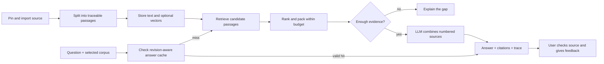

# Why IntelliRAG works this way

This describes the **TypeScript web application**, as inspected on 16 September 2026. The Python platform in `rag-platform/` is a separate implementation. Its cross-encoder and MMR descriptions do not describe this app.

## The problem

A developer-support engineer has a specific decision to make. The repository explains individual APIs, but the answer requires combining their rules. Searching for a phrase is only the first step. The person must still identify the relevant version, connect the evidence, check the conclusion, and decide whether to escalate.

Our example preloads **the README only** from `sindresorhus/p-queue` at commit `180ab9e25cd10b6f548767d7176076b50d25e188`. It does not claim to ingest the entire repository.

> We need to change shared configuration while jobs are waiting. How can we finish running work safely without waiting for the entire queue to empty?

The needed facts are spread across `pause`, `onPendingZero`, `onIdle`, and `start`. The decision is to stop new starts, drain running work, change the configuration, and resume. Waiting for idle while paused with queued work can prevent progress. That last conclusion is a **synthesis of the documented rules**, not a verbatim answer in the README.

## Follow one question

## Each choice, in plain terms

| Step | What it does and why | Cost or failure to watch | How to check it |
|---|---|---|---|
| Source identity | Keep repository, revision, path and corpus identity so an answer can be tied to a particular source. | A successful import is not a scheduled freshness guarantee. | Inspect source URI/revision; change and re-import a fixture. |
| Ingestion | A repo root enumerates eligible files; a blob URL imports that file; an issue URL imports that issue. | Filtering and upstream failures can leave missing evidence. | Record files attempted/accepted, errors, hashes and elapsed time. |
| Chunking | Split prose around structure; preserve code boundaries and symbols where possible. Defaults are about 512 tokens with 25 overlap. | Splitting can separate a condition from its exception. Approximate tokens are not provider billing tokens. | Check that every annotated evidence span survives chunking. |
| Embeddings | Optionally map passages and questions into vectors using the same model and dimensions. | Vectors cost money and can go stale; mismatched models are not comparable. | Count compatible vectors; require a complete index for dense/hybrid acceptance. |
| Storage | Use local file-backed PGlite; use configured Postgres for durable hosted data. Serverless without Postgres is explicitly ephemeral. | Cold starts can lose temporary imports. | Health endpoint, restart test, successful query after reload. |
| Corpus selection | Search the source the user selected. All-corpora search is an explicit choice. | Mixing unrelated repos can make similar API names look relevant. Corpus selection is not access control. | Cross-corpus regression tests and candidate corpus IDs. |
| Keyword retrieval | BM25 finds words and identifiers that match the question. | Paraphrases can miss exact vocabulary. | Required evidence recall and rank against annotated source passages. |
| Dense retrieval | Cosine similarity finds meaning beyond exact wording, when compatible vectors exist. | Similar-sounding text may not answer the question. | Compare dense alone, keyword alone and hybrid on the same frozen corpus. |
| Fusion | Reciprocal rank fusion combines candidate ordering without pretending BM25 and cosine scores are the same units. | More channels are not automatically better. | Preserve separate channel ranks and run ablations. |
| Reranking | A calibrated mix uses lexical overlap, titles and available dense signals. It is not a trained cross-encoder. | Hand-tuned rules can overfit runbooks and hurt API documentation. | Compare against plain BM25; keep losing cases visible. |
| Context packing | Keep supported passages within an approximate 1,400-token budget and three-chunk cap. Remove repeated text, not every passage from the same file. | A narrow window can exclude a needed second fact. The earlier document-level deduplication rule caused exactly this. | Measure complete-evidence coverage before and after packing. |
| Evidence gate | Refuse when the retrieved passages clearly cannot support the requested information. | Lexical overlap is not proof. Some unknown questions still reach the model. | Measure false refusal and unsupported-answer rates separately, after generation too. |
| Generation | The LLM receives numbered passages and a grounding instruction, then streams an answer. OpenRouter uses Gemini 3.7 Flash. | A model can ignore evidence, truncate, or make an unsupported inference. | Grade each required decision and each material claim; record actual model, usage and errors. |
| Citations | Map `[Source N]` references back to the selected passages. | A valid citation ID does not establish that its passage supports the claim. | Check link validity separately from citation entailment. |
| Visible graph | Show extracted relationships, source locations, inferred connections, feedback and cache traces. | An inferred edge is not a verified fact or proof of graph reasoning. | Inspect provenance and compare retrieval with graph preferences disabled. |
| Cache | Reuse an answer only for matching question, corpus, revisions, settings and policy. | A fast cached answer can hide a retrieval regression. | Bypass cache for quality tests; test cache speed and invalidation separately. |
| Feedback | A useful/dead-end/correction signal can affect source preference. | Repeated votes or mistaken edits must not turn into documentary evidence. | Distinct-question promotion and correction-revocation tests. |
| Interface | Keep the question bar visible, graph inspectable, and side panels optional. | Hiding the composer makes the main task impossible. | Desktop/mobile tests from first visit through asking and source inspection. |

## Why this is a plausible paid use case

Start with **technical support for a developer tool**, focused on configuration and troubleshooting questions about one documented product. The useful deliverable is a verified answer with a source revision and an explicit uncertainty boundary. The buyer hypothesis is a support or engineering lead whose team repeatedly escalates these questions. This remains a hypothesis, not a claim of product-market fit.

The [market research and pilot guide](../sales/research-and-pilot.md) records primary-source observations and an interview plan. The commercial test is time to a **human-verified answer**, engineer escalation rate, supported-claim rate, and actual cost per resolved case. Chat volume and attractive graphs are not business outcomes. Broader enterprise search requires durable storage, permissions, source refresh, deletion handling and workspace isolation before it is credible.

## What the current experiment establishes

The [repository-support diagnostic](../../eval/repo-support/README.md) uses actual chunking, BM25, reranking, packing and gating code. Its first run found a document-deduplication bug. After the fix, evidence recall rose from 36.7% to 70.0%; plain BM25 remained at 73.3% on the same 15 answerable cases. These are narrow evidence-retention measurements, not generated-answer accuracy.

The cloud generation, independent judging, dense retrieval, production cost and production latency measurements are separate work. A provider key does not by itself complete the evaluation or validate a superiority claim.

## The next decisions should follow failures

1. Check missing evidence before changing the prompt. An LLM cannot reliably repair context it never received.
2. Test semantic retrieval on paraphrases before increasing context size everywhere.
3. Compare a full-README prompt. For a small corpus, a simpler long-context baseline may be sufficient.
4. Add an independent repository and human-adjudicated support tickets before making a general performance claim.
5. Prove freshness and permissions before inviting private customer data.

Implementation entry points: `web/src/lib/rag/{ingest.server,chunking,retrieve-core,ranking,evidence,query.server}.ts`; storage and graph code are adjacent. The evaluation freezes source hashes and hashes the relevant implementation files so uncommitted local changes are visible in run provenance.
